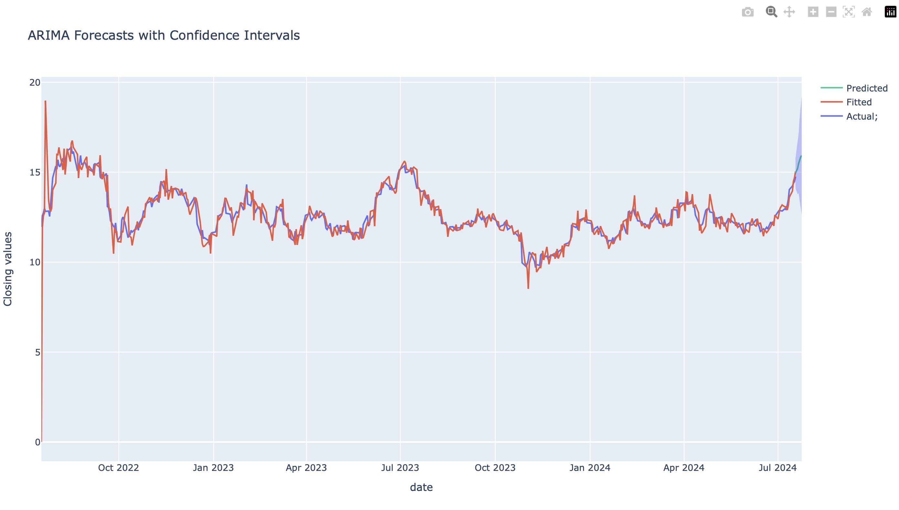
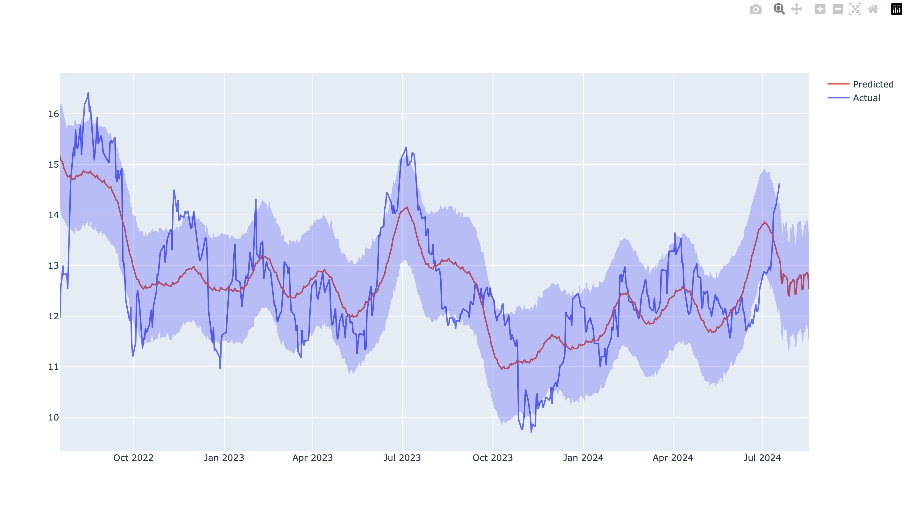
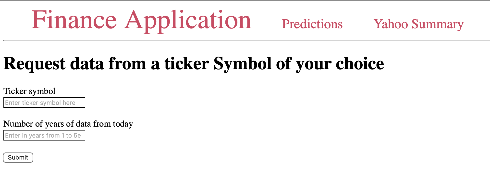

# An interactive Yfinance based live ingestion application which can forecast stock data using ARIMA/SARIMA and Prophet API models.  

## Highlights of this project are 
- Yfinance for data ingestion
- Statsmodels and Prophet for data modeling
- Plotly for data visualization
- Flask for web api  
- Docker for containerizing the application

## SARIMA/ARIMA 
ARIMA is a model for time series forecasting. The name stands for auto regressive integrated moving average.  The program takes 3 parameters, p,d and q with default values of 1, 1, 1

SARIMA is a variant of the arima model that accounts for seasonality.  It has an additional parameter s that sets the seasonal period (default is 4).  There are also aditional PDQ parameters for the seasonal period that are set to 1 by default.

p determines how many auto regressive terms are in the model, or how many terms there are based on previous predictions from the model
q determines how many moving average terms are in the model, or how many are based on the error
d determines how many times the data is differenced. This is done to make the data stationary, usually a value of d=1 is satisfactory

SARIMA is a variant of the arima model that accounts for seasonality.  It has an additional parameter s that sets the seasonal period (default is 4).  There are also aditional PDQ parameters for the seasonal period that are set to 1 by default.

## Facbook Prophet
Facebook Prophet is an open-sourced tool available in Python or R that specifically helps with time-series forecasting. The motivation behind Prophet was to create something easy to use but customizable.  One of its strengths is its ability to handle seasonal data. Prophet provides a collection of options in its models. These include uncertainty estimation, logistic vs linear regression, trend changepoints, and the ability to add regressors.

You can visit the Facebook Open-Source description of the project on GitHub to install or get additional information on how to use it.  The repository itself is also on GitHub. The links are below:

https://facebook.github.io/prophet/

### Usage of the application

- First the API gives the user an interface to choose a ticker symbol and the duration of data to train the model on from current date
- Then the application shows an initial plot of the time series data of the chosen ticker sybmol for the duration selected along with the ADFueller test for stationarity. A p-value less than 0.05 indicates that the data is stationary.
- At this point, the user can pick a model for forecasting
- If Arima is chosen, the user will be presented with a PACF, ACF and first order difference. 
  1. At this point the user can make a best guess p,d,q estimate and enter a duration for forecasting can be entered in the input fields
  2. An additional seasonality option using the SARIMAX can be checked to account for any seasonal variations in the data.
- For Prophet, the beauty of the model is that it is absolutely automated and no parameters need be set except the duration of forecast required. 

